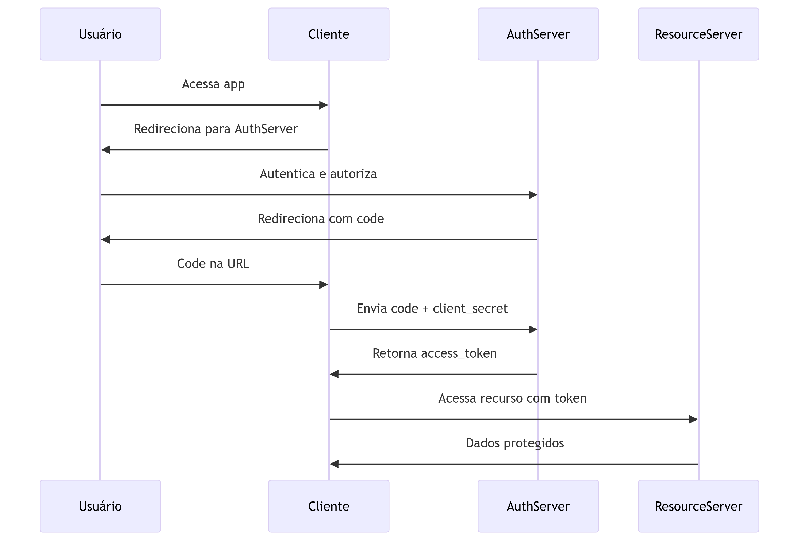
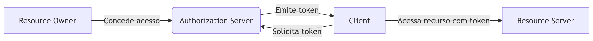
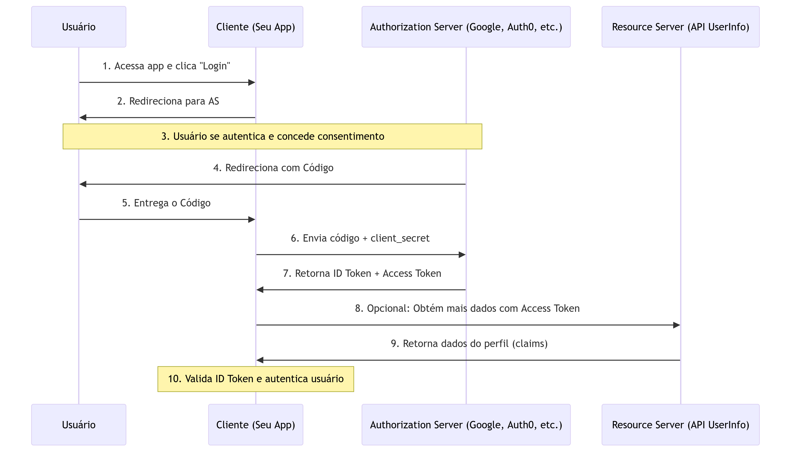
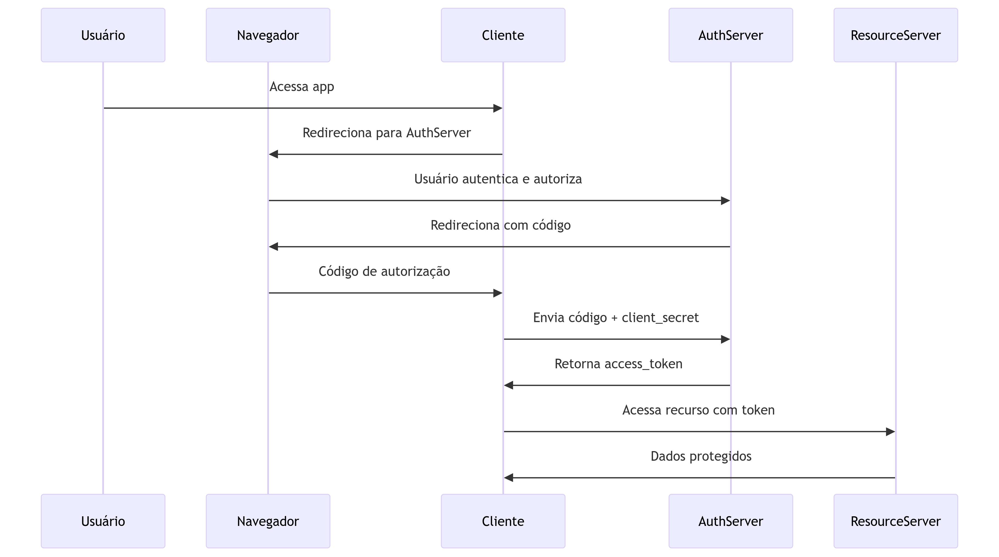
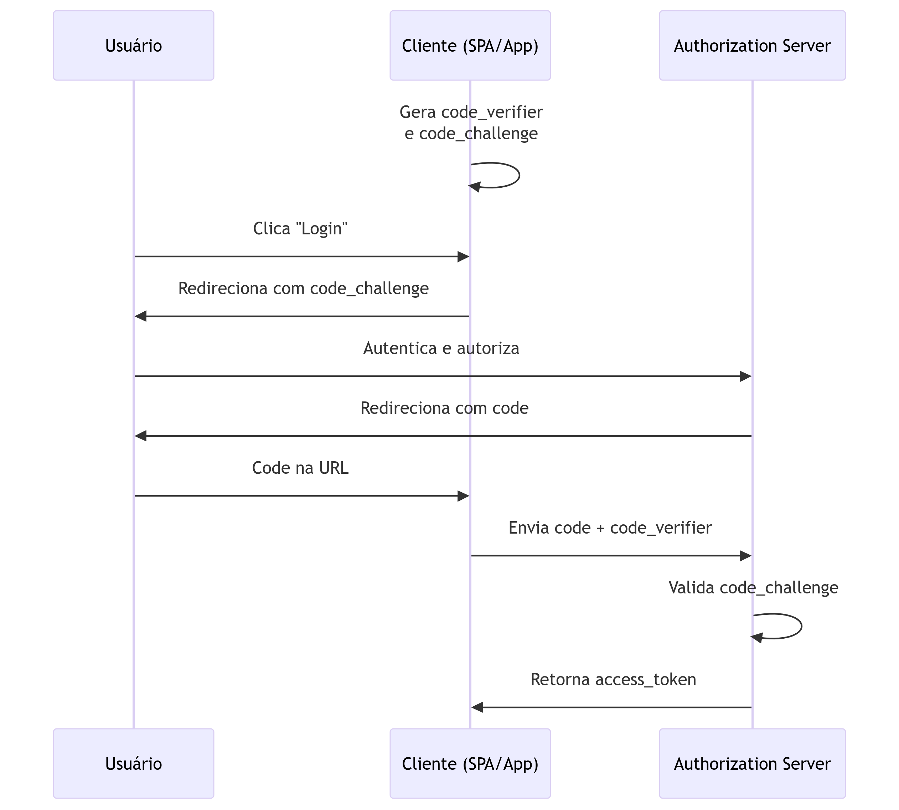

# Master OAuth 2.0: A Practical Guide to API Security

## About

> [`https://www.udemy.com/course/master-oauth-2-api-security-practical-guide`](https://www.udemy.com/course/master-oauth-2-api-security-practical-guide)

OAuth 2.0 with practical flows, implementations, real-world use cases, and decision-making for robust API architectures.

### O que se aprenderá

- Learn OAuth 2.0 Token Types and Formats: Explore access tokens, refresh tokens, JWT, and opaque tokens to secure modern APIs.
- Understand Token Validation Methods: Discover when to use local validation or introspection for efficient and secure token verification.
- Choose the Right OAuth Client Type: Learn when to use public or confidential clients.
- Define and Structure OAuth Scopes: Learn to name and structure OAuth scopes for effective, granular API access control.
- Gain Basics of OIDC: Understand how OpenID Connect extends OAuth for user authentication and single sign-on.
- Master User-Initiated Flows: Learn Implicit, Authorization Code, and PKCE flows for secure user authentication.
- Explore Flow Challenges: Analyze vulnerabilities with real-world hacker scenarios and address them effectively.
- Choose the Best Flow: Use decision trees to identify the ideal OAuth flow for your project needs.
- Discover Advanced Flow Mechanisms: Learn JWT Secured Authorization Request (JAR), JWE, and Pushed Authorization Request (PAR) to enhance OAuth 2.0 security.
- Implement Machine-to-Machine Flows: Learn the Client Credentials Flow for secure backend service communication.
- Understand ROPC and Device Code Flows: Discover flows like Resource Owner Password Credentials and Device Code for resource owner and devices with limited input
- Master Advanced Advanced Client Authentication Methods: Use JWT, SAML assertions, and X.509 mTLS for robust API security.
- Learn mTLS X.509 Basics: Build foundational knowledge of mutual TLS, X.509 certificates, and Public Key Infrastructure (PKI).
- Secure OAuth 2.0 Access Tokens: Protect your tokens with advanced FAPI-compliant mechanisms like mutual TLS and Demonstration of Proof-of-Possession (DPoP).
- Integrate External Identity Providers: Connect with partners, JWT providers, and external systems for scalable identity solutions.
- Connect with Legacy and SAML Systems: Integrate with legacy infrastructures and SAML for phased migrations.
- Simulate Real-World Scenarios: Analyze attacker scenarios and explore diverse project architectures.
- Make Informed Decisions: Use decision trees to select the best OAuth flows and mechanisms for secure architectures.

## OAuth 2.0 Basics

### Authorization Code Grant Flow

Fluxo Padrão do OAuth 2.0 (Authorization Code Grant)

- **Solicitação de Autorização:**
  - O cliente redireciona o usuário ao servidor de autorização com parâmetros como `client_id`, `redirect_uri`, `scope` e `state`.
- **Autenticação e Consentimento:**
  - O usuário autentica-se e concede permissão ao cliente para acessar os recursos solicitados.
- **Código de Autorização:**
  - O servidor de autorização redireciona o usuário de volta ao cliente com um **código de autorização** (`code`) no parâmetro da URL.
- **Solicitação de Token:**
  - O cliente troca o código de autorização por um **token de acesso** (`access token`), enviando uma requisição direta (`back-channel`) ao servidor de autorização com `client_id`, `client_secret`, `code` e `redirect_uri`.
- **Token de Acesso:**
  - O servidor de autorização valida as credenciais e emite um `access token` (e opcionalmente um `refresh token`).
- **Acesso ao Recurso:**
  - O cliente usa o token de acesso para acessar recursos protegidos no servidor de recursos via cabeçalho `Authorization: Bearer <token>`.
- **`Refresh Token` (Opcional):**
  - Se o token expirar, o cliente pode usar o `refresh token` para obter um novo `access token` sem interação do usuário.



**Pontos-Chave**:

- **Fluxo mais seguro** para aplicações web com back-end.
- Usa **código de autorização** (nunca tokens no front-channel).
- Exige **client_secret** (apenas para clientes confidenciais).
- **PKCE** é recomendado para clientes públicos (ex.: mobile/SPA).

### Roles (Papéis) do OAuth 2.0

1. **Resource Owner** (Proprietário do Recurso)
  - **O que é:** O usuário final que possui os dados protegidos e pode conceder acesso a eles.
  - **Exemplo:** Você, ao autorizar um app a acessar suas fotos no Google Fotos.
2. **Client** (Cliente)
  - **O que é:** A aplicação que solicita acesso aos recursos do usuário em seu nome.
  - **Exemplo:** Um app de impressão de fotos que quer acessar suas imagens.
3. **Resource Server** (Servidor de Recurso)
  - **O que é:** O servidor que hospeda os recursos protegidos do usuário e aceita tokens de acesso para permitir o acesso.
  - **Exemplo:** API do Google Drive que armazena seus arquivos.
4. **Authorization Server** (Servidor de Autorização)
  - **O que é:** O servidor que autentica o usuário, obtém seu consentimento e emite tokens de acesso aos clientes.
  - **Exemplo:** Serviço de login do Google que emite tokens após a autenticação.
5. **User Agent** (Agente do Usuário)
  - **O que é:** O navegador ou aplicativo móvel que atua como intermediário nas interações front-channel (redirecionamentos).
  - **Exemplo:** Chrome, Safari ou o app nativo do celular que redireciona o usuário durante o fluxo OAuth.



**Observações**:

- O **Authorization Server** e **Resource Server** podem ser da mesma organização (ex.: Google) ou separados.
- O **Client** pode ser **público** (não guarda segredos, como SPAs) ou **confidencial** (aplicações com back-end).

### OAuth 2.0: Public vs. Confidential Clients

**Confidential Clients**:

- **Capacidade de Armazenar Segredos**: Podem manter credenciais confidenciais (ex.: `client_secret`) de forma segura.
- **Ambiente Controlado**: Executam em servidores seguros (back-end), onde o código e os segredos não são expostos ao usuário final.
  - **Exemplos**:
      - Aplicações web tradicionais (ex.: Java Spring, Node.js com servidor).
      - Serviços backend (ex.: microserviços).
- **Autenticação**: Usam `client_secret` ou métodos avançados (ex.: Private Key JWT, mTLS).
- **Segurança**: Considerados mais seguros porque o `client_secret` não é acessível ao público.

**Public Clients**:

- **Incapacidade de Armazenar Segredos**: Não podem manter credenciais confidenciais porque o código é executado em ambientes não confiáveis.
- **Ambiente Exposto**: Executam no dispositivo do usuário (front-end), onde segredos podem ser extraídos.
  - **Exemplos**:
    - Single-Page Applications (SPAs) (ex.: React, Angular).
    - Aplicativos móveis nativos (ex.: Android, iOS).
    - Aplicações desktop.
- **Autenticação**: Usam PKCE (Proof Key for Code Exchange) para substituir o client_secret e prevenir ataques.
- **Segurança**: Dependem de mecanismos como PKCE e redirecionamentos seguros.

**Diferenças Chave**:

| Aspecto       | Confidential Clients                   | Public Clients                        |
| :------------ | :------------------------------------- | :------------------------------------ |
| Armazenamento | Ambientes seguros (servidor)           | Dispositivos do usuário (inseguros)   |
| Autenticação  | `client_secret`, Private Key JWT, mTLS | PKCE (sem `client_secret`)            |
| Exemplos      | Aplicações web com back-end            | SPAs, apps móveis, apps desktop       |
| Complexidade  | Maior (gerenciamento de segredos)      | Menor (sem segredos)                  |
| Recomendações | Usar fluxo Authorization Code          | Usar Authorization Code + PKCE        |

**Por que a Distinção é Importante**?

- **Segurança**: Confidential clients podem usar métodos de autenticação mais fortes.
- **Usabilidade**: Public clients precisam de fluxos adaptados (ex.: PKCE) para compensar a falta de segredos.
- **Especificações**: OAuth 2.0 e OAuth 2.1 exigem tratamentos diferentes para cada tipo.

**Exemplo de Fluxo com PKCE (Public Clients)**:

1. Cliente gera `code_verifier` e `code_challenge`.
1. Redireciona o usuário com `code_challenge`.
1. Servidor de autorização emite um código de autorização.
1. Cliente troca o código por um token usando `code_verifier` (sem `client_secret`).

### OAuth 2.0 Scopes

**O que é**?

O escopo (scope) é um mecanismo que define as permissões que um cliente solicita para acessar os recursos do usuário. Ele delimita até onde o cliente pode agir em nome do usuário (ex.: ler dados, escrever dados, acessar APIs específicas).

**Estrutura**

- Os escopos são representados como uma lista de strings separadas por espaços.
- Cada string define uma permissão específica.
- Exemplo: `scope=read:contacts write:files openid email`

**Nomenclatura**

- **Formato**: Recomenda-se usar uma estrutura hierárquica com : para organizar os escopos.
- **Exemplos**:
  - `read:contacts` (ler contatos)
  - `write:files` (escrever arquivos)
  - `openid` (acesso ao perfil do usuário via OpenID Connect)
  - `email` (acesso ao endereço de e-mail)
- **Boas Práticas**:
  - Usar nomes descritivos e intuitivos.
  - Evitar escopos genéricos como `access` ou `all`.
  - Seguir padrões definidos pela API (ex.: Google escopos).

**Estratégias**

- Escopos Granulares
  - Permissões específicas para cada operação (ex.: `read:contacts`, `delete:contacts`).
  - **Vantagem**: Maior controle e segurança.
  - **Desvantagem**: Pode levar a muitos escopos complexos.
- Escopos Agrupados
  - Escopos que concedem acesso a um conjunto de funcionalidades (ex.: `profile` pode incluir nome, e-mail e foto).
  - **Vantagem**: Simplicidade para o usuário.
  - **Desvantagem**: Pode conceder permissões desnecessárias.
- Escopos Dinâmicos
  - O cliente solicita escopos adicionais durante o fluxo conforme a necessidade.
  - **Exemplo**: Um app pode pedir `read:contacts` inicialmente e depois `write:contacts` quando o usuário for adicionar um contato.
- Escopos Incrementais
  - O cliente solicita permissões mínimas inicialmente e pede escopos adicionais em momentos específicos.
  - **Vantagem**: Melhora a experiência do usuário (não pede tudo de uma vez).

**Fluxo no OAuth 2.0**

- **Solicitação**: O cliente inclui o parâmetro scope na requisição de autorização.
  - `https://auth-server.com/authorize?client_id=123&scope=read:contacts&redirect_uri=...`
- **Consentimento**: O usuário vê os escopos solicitados e decide autorizar ou negar.
- **Token**: O servidor de autorização emite um token de acesso limitado aos escopos aprovados.
- **Validação**: O servidor de recursos verifica se o token tem o escopo necessário para a operação.

**Exemplo de Uso**

```sh
# Solicitação de autorização
GET /authorize?client_id=abc&scope=read:contacts+write:files&redirect_uri=...

# Token de acesso com escopos
{
  "access_token": "xyz123",
  "token_type": "Bearer",
  "scope": "read:contacts write:files"
}
```

**Boas Práticas**

- **Princípio do Menor Privilégio**: Solicitar apenas os escopos necessários.
- **Transparência**: Exibir claramente ao usuário o que cada escopo significa.
- **Validação no Resource Server**: Sempre verificar se o token tem o escopo para a ação solicitada.

Os escopos são fundamentais para garantir que o cliente tenha **apenas as permissões necessárias**, protegendo a privacidade e a segurança do usuário. Estratégias bem definidas de escopo melhoram a experiência e a confiança na aplicação.

**Como Derivar Escopos do OAuth 2.0 de Forma Eficaz**?

A derivação eficaz de escopos no OAuth 2.0 requer uma abordagem estruturada que equilibre segurança, usabilidade e facilidade de manutenção. Aqui está um guia direto:

Princípios para Derivação de Escopos

- **Privilégio Mínimo**: Conceda apenas as permissões necessárias para a funcionalidade do cliente.
- **Design Centrado no Usuário**: Garanta que os escopos sejam compreensíveis durante o consentimento.
- **Alinhamento com a API**: Espelhe a estrutura e os recursos da sua API.
- **Flexibilidade**: Permita permissões amplas e granulares conforme a necessidade.

Estratégias para Derivar Escopos

- Escopos Baseados em Recursos
  - Derive os escopos dos recursos expostos pela API.
  - **Formato**: `{ação}:{recurso}`
  - **Exemplos**:
    - `ler:contatos, escrever:contatos, excluir:contatos`
    - `ler:arquivos, upload:arquivos, compartilhar:arquivos`
- Escopos Baseados em Funções
  - Agrupe permissões em funções para simplificar.
  - **Exemplos**:
    - `usuario` (leitura/escrita básica), `admin` (acesso total), `moderador` (acesso limitado).
    - **Caso de Uso**: Ideal para aplicativos com funções de usuário bem definidas.
- Escopos Funcionais
  - Defina escopos com base na funcionalidade do cliente, não apenas em recursos.
  - **Exemplos**:
    - `postar_mensagem` (para um app de mídia social), `processar_pagamento` (para e-commerce).
  - **Vantagem**: Alinhamento mais próximo com o que o cliente realmente faz.
- Escopos Hierárquicos
  - Crie escopos aninhados onde escopos amplos implicam permissões mais restritas.
  - **Exemplo**: escrever pode incluir `ler`, mas isso exige cuidado para não conceder privilégios excessivos.

Passos Práticos para Derivar Escopos

- Inventariar Endpoints da API:
  - Liste todos os endpoints e as ações que realizam (GET, POST, PUT, DELETE).
  - Exemplo: GET /api/contatos → ler:contatos.
- Agrupar Ações e Recursos:
  - Agrupe ações ou recursos semelhantes para evitar explosão de escopos.
  - Exemplo: gerenciar:contatos pode incluir criar, ler, atualizar, excluir.
- Definir Sintaxe dos Escopos:
  - Use uma convenção de nomenclatura consistente (ex.: {ação}:{recurso}).
  - Evite termos ambíguos como acesso ou usar.
- Mapear Escopos para Necessidades do Cliente:
  - Para cada cliente, determine o conjunto mínimo de escopos necessários.
  - Exemplo: Um app de backup pode precisar apenas de ler:arquivos.
- Implementar Escopos Incrementais:
  - Permita que clientes solicitem escopos adicionais posteriormente (ex.: durante a execução).

Exemplos de Escopos Bem-Projetados

 APIs do Google: https://www.googleapis.com/auth/calendar.readonly
- GitHub: repo, user:email, ler:org
- -API Customizada: ler:projetos, escrever:tarefas, excluir:comentarios

Validação e Aplicação

- Servidor de Autorização: Emite tokens apenas com os escopos aprovados.
- Servidor de Recurso: Valida o escopo para cada solicitação à API.

```java
    // Exemplo em Java/Spring
    @PreAuthorize("hasAuthority('SCOPE_ler:contatos')")
    public List<Contact> getContacts() { ... }
```

Ferramentas e Técnicas

- Especificação OpenAPI: Anote endpoints com os escopos necessários.

```yaml
    paths:
      /contatos:
        get:
          security:
            - oauth2: ['ler:contatos']
```

- Registro Dinâmico de Escopos: Permita que clientes registrem escopos personalizados para APIs flexíveis (menos comum).

Armadilhas Comuns a Evitar

- **Granularidade Excessiva**: Muitos escopos complicam o consentimento e o gerenciamento.
- **Granularidade Insuficiente**: Poucos escopos concedem permissões excessivas.
- **Nomenclatura Pobre**: Nomes unclear de escopos confundem usuários e desenvolvedores.

Evolução e Versionamento

- **Versionar Escopos**: Se a API mudar, introduza novos escopos (ex.: v2.ler:contatos).
- **Descontinuação**: Planeje a aposentadoria de escopos antigos sem quebrar clientes.

A derivação eficaz de escopos requer:

- Entender a estrutura da API e as necessidades dos clientes.
- Aplicar o princípio do privilégio mínimo.
- Usar convenções de nomenclatura consistentes e claras.
- Validar escopos tanto no servidor de autorização quanto no servidor de recurso.

Seguindo essas práticas, você cria um sistema OAuth2 seguro e amigável que escala com sua API.

### Access Token vs Refresh Token

Access Token:

- **O que é**: Credencial de curta duração (ex.: 1 hora) usada para acessar recursos protegidos.
- **Função**: Autorizar solicitações à API (ex.: `GET /dados`).
- **Localização**: Enviado no cabeçalho `Authorization: Bearer <token>`.
- **Segurança**: Se exposto, pode ser usado por atacantes até expirar.

Refresh Token:

- **O que é**: Credencial de longa duração (ex.: 30 dias) usada para obter novos access tokens.
- **Função**: Renovar access tokens sem exigir nova autenticação do usuário.
- **Localização**: Armazenado com segurança no cliente (ex.: banco de dados).
- **Segurança**: Mais crítico que o access token – se vazado, permite gerar novos access tokens indefinidamente.

Diferença Chave:

| Aspecto   | Access Token                     | Refresh Token                  |
| :-------- | :------------------------------- | :----------------------------- |
| Duração   |	Curta (minutos/horas)            | Longa (dias/meses)             |
| Uso       |	Acesso a APIs                    | Obter novos access tokens      |
| Exposição |	Enviado em toda requisição à API | Armazenado no cliente          |
| Risco     | Médio (expira rápido)            | Alto (pode gerar novos tokens) |

Exemplo de Fluxo:

- Usuário faz login → Recebe `access_token` (1h) + `refresh_token` (30d).
- Quando `access_token` expira, o cliente usa o `refresh_token` para obter um novo.
- Se `refresh_token` expirar, o usuário precisa autenticar novamente.

Por que Usar os Dois?

- **Segurança**: Access tokens de curta duração limitam o risco de vazamento.
- **Usabilidade**: Refresh tokens evitam que o usuário precise logar frequentemente.

> ⚠️ **Importante**: Refresh tokens devem ser armazenados com segurança (ex.: HTTP-only cookies, armazenamento seguro no servidor).

### Formato de Tokens: Opaque Token vs JWT

Opaque Token:

- **O que é**: Uma string aleatória opaca (sem significado interno), como um UUID.
- **Funcionamento**: O servidor de recursos precisa consultar o authorization server (via introspection) para validar o token e obter seus dados (ex.: scopes, expiração).
- **Vantagem**: Mais seguro - as informações não são expostas no próprio token.
- **Desvantagem**: Requer uma chamada adicional ao authorization server para validação.

Exemplo:

- `abc123def-4567-89ab-cdef-0123456789ab`

JWT (JSON Web Token):

- **O que é**: Token autocontido em formato JSON, composto por Header, Payload e Signature.
- **Funcionamento**: O servidor de recursos valida o token verificando a assinatura (usando uma chave pública) e lê os dados diretamente do payload.
- **Vantagem**: Mais eficiente - não requer consulta ao authorization server a cada validação.
- **Desvantagem**: Se não for assinado/criptografado corretamente, pode ser vulnerável.

Estrutura:

- `header.payload.signature`

Exemplo de Payload:

```json
{
  "sub": "1234567890",
  "name": "João Silva",
  "scope": "read:contacts",
  "exp": 1718900000
}
```

Diferença Chave:

| Aspecto       | Opaque Token                        | JWT                                   |
| :------------ | :---------------------------------- | :------------------------------------ |
| Estrutura     | String aleatória (opaca)            | JSON autocontido (header.payload.sig) |
| Validação     | Requer introspection no auth server | Validação local via assinatura        |
| Performance   | Mais lento (chamada de rede)        | Mais rápido (validação local)         |
| Transparência | Nenhum dado visível no token        | Dados visíveis (se não criptografado) |
| Uso Comum     | Sistemas com alta segurança         | APIs distribuídas ou stateless        |

Quando Usar?

- **Opaque**: Quando a segurança é crítica e você controla o auth server.
- **JWT**: Quando performance e escalabilidade são prioritárias (ex.: microserviços).

> 🔒 **Dica**: Para JWTs, sempre use assinatura (JWS) e considere criptografia (JWE) para dados sensíveis.

### OpenID Connect (OIDC) e comparação com o OAuth 2.0

**OpenID Connect (OIDC): O que é**?

O OpenID Connect (OIDC) é um protocolo de autenticação construído sobre o OAuth 2.0. Ele permite que aplicações verifiquem a identidade de um usuário de forma segura e obtenham informações básicas do seu perfil.

Problema que Resolve:

- Evitar que cada site exija seu próprio login/senha.
- Permitir que usuários se autentiquem usando contas que já possuem (ex.: Google, Facebook, Microsoft).

**Como Funciona (Simplificado)**:

- Você clica em "Login com Google" em um site.
- O site redireciona você para o Google.
- Você faz login no Google e autoriza o site a acessar seu perfil.
- Google redireciona você de volta ao site com um **ID Token**.
- O site valida o ID Token e sabe quem você é.

**Componentes Principais**:

- **ID Token**: Um JWT que contém informações do usuário (ex.: nome, email).
- **UserInfo** Endpoint: Uma API que retorna mais dados do perfil (usando o access token).
- **Claims**: Dados padrão como `sub` (ID do usuário), `email`, `name`.

**Exemplo de ID Token (JWT)**:

```json
{
  "iss": "https://accounts.google.com",
  "sub": "1234567890",
  "aud": "meu-site",
  "email": "usuario@gmail.com",
  "name": "João Silva",
  "picture": "https://photo.jpg"
}
```

**Diferença Chave vs OAuth 2.0**:

- **OAuth 2.0**: Foca em autorização (acessar recursos como fotos ou posts).
- **OIDC**: Foca em autenticação (saber quem é o usuário).

**Vantagens**:

- ✅ Seguro (usa tokens JWT assinados).
- ✅ Simples para o usuário (não precisa criar nova conta).
- ✅ Padronizado (funciona com qualquer provedor: Google, Azure, etc.).

**Fluxo do OIDC**:

O fluxo mais comum e seguro do OIDC é o Authorization Code Flow, que utiliza o fluxo de código de autorização do OAuth 2.0 e adiciona a funcionalidade de autenticação. Aqui está uma versão simplificada e direta.



***Fluxo do OIDC***

- **Início do Login**: O usuário clica em "Entrar com Google" (ou outro IdP) em um aplicativo (o Cliente).
- **Solicitação de Autenticação**: O aplicativo redireciona o navegador do usuário para o Authorization Server (AS, ex.: Google). A URL inclui parâmetros como:
  - `client_id`: Identificador do aplicativo.
  - `redirect_uri`: Para onde o AS deve enviar a resposta.
  - `response_type=code`: Solicita um código de autorização.
  - `scope=openid email profile`: Solicita permissão para autenticar e acessar o perfil.
- **Autenticação e Consentimento**: O usuário se autentica no AS (digita senha) e concorda em conceder as permissões solicitadas pelo aplicativo.
- **Código de Autorização**: O AS redireciona o navegador de volta para o aplicativo, enviando um código de autorização (code) como parâmetro na URL.
- **Cliente Recebe o Código**: O aplicativo (backend) captura o código da URL.
- **Troca do Código por Tokens**: O aplicativo (backend) faz uma requisição diretamente (back-channel) para o AS. Envia o código + client_secret (credencial que prova sua identidade).
- **Tokens Emitidos**: O AS valida as informações e responde com os tokens:
  - **ID Token (JWT)**: O mais importante. É um JWT que contém as informações (claims) do usuário (ex.: ID, nome, email). Prova que a autenticação foi bem-sucedida.
  - **Access Token**: Usado para acessar endpoints adicionais, como a API UserInfo.
  - **Refresh Token**: Opcional, para obter novos tokens sem reautenticação.
- **Validação e Login**: O aplicativo valida o ID Token (verifica assinatura, emissor, expiração) e, se tudo estiver correto, cria uma sessão para o usuário, efetivando o login.
- **(Opcional) Solicitar Informações Adicionais**: Se necessário, o aplicativo pode usar o Access Token para chamar o endpoint UserInfo e obter mais dados do perfil do usuário.

**Por que este fluxo é seguro**?

- O **ID Token** é assinado, garantindo sua autenticidade.
- O **Access Token** é transmitido apenas pelo back-channel (servidor-para-servidor).
- O usuário **nunca** vê ou manipula os tokens diretamente.

**Por que Desenvolvedores Gostam**:

- Economiza tempo (não precisa construir sistema de login).
- Mais seguro (provedores grandes cuidam da segurança).
- Experiência do usuário melhor (sem senhas novas para lembrar).

**Resumo**:

OIDC é o "login com redes sociais" por trás dos panos, mas de forma padronizada e segura. É a solução moderna para autenticação na web.

## OAuth 2.0 User-Initiated Flows

Secure authorization for Web and Mobile applications.

- Implicit Flow (deprecated)
- Authorization Code Flow
- PKCE Flow

### OAuth 2.0 Implicit Flow

> ⚠️ **Atenção:** Este fluxo é considerado inseguro e foi depreciado.

Não é recomendado para novas implementações. Foi substituído pelo Authorization Code Flow com PKCE.

- [Playground: OAuth 2.0 Implicit Flow](https://www.oauth.com/playground/implicit.html)

**Funcionamento Simplificado**:

- Cliente Redireciona o Usuário:
  - O cliente (ex.: uma SPA) redireciona o navegador para o servidor de autorização com os parâmetros:

```sh
response_type=token
client_id=123
redirect_uri=https://cliente.com/callback
scope=leitura
```

  - Exemplo de URL:

```text
https://auth-server.com/authorize?response_type=token&client_id=123&redirect_uri=https://cliente.com/callback&scope=leitura
```

- Usuário Autentica e Autoriza:
  - O usuário faz login no servidor de autorização e concede permissão ao cliente.
- Servidor Redireciona com Token no Fragmento da URL:
  - O servidor redireciona de volta para o `redirect_uri` com o access token no fragmento (parte após `#`) da URL:

```text
https://cliente.com/callback?access_token=abc123&token_type=Bearer&expires_in=3600
```

- Cliente Extrai o Token:
  - O cliente (JavaScript) lê o token do fragmento da URL usando:

```sh
window.location.hash
```

- Cliente Usa o Token:
  - O cliente usa o access token para acessar recursos protegidos:

```http
GET /api/dados-protegidos HTTP/1.1
Authorization: Bearer abc123
```

**Problemas Críticos (*Por que foi depreciado*)**:

- **Token Exposto no Navegador**:

  O token fica visível no histórico do navegador, logs de servidor e pode ser vazado via `Referer` header.

- **Sem Autenticação do Cliente**:

  Não há `client_secret`, tornando fácil impersonation.

- **Sem Refresh Token**:

  Tokens de curta duração exigem novo login frequente.

- **Vulnerável a Token Injection**:

  Atacantes podem injetar tokens maliciosos na URL.

**Alternativa Moderna (*Use isto!*)**:

**`Authorization Code Flow + PKCE`** para clientes públicos (SPAs, apps móveis).

- Mantém o token seguro no back-channel.
- Usa `PKCE` (`code_challenge` e `code_verifier`) para substituir o `client_secret`.

**Resumo Histórico**:

- **Propósito Original**: Simplificar o fluxo para clientes públicos (como SPAs) antes do PKCE existir.
- **Status Atual**: Depreciado por padrões de segurança modernos (OAuth 2.1 removeu este fluxo).

**Referência**: 

- [OAuth 2.0 Security Best Practices](https://datatracker.ietf.org/doc/html/draft-ietf-oauth-security-topics-16#section-2.1.2)

### OAuth 2.0 Authorization Code Flow

- [Playground: OAuth 2.0 Authorization Code Flow](https://www.oauth.com/playground/authorization-code.html)
- Fluxo Mais Seguro e Recomendado

**Funcionamento Simplificado**:

- Cliente Redireciona o Usuário:
  - O cliente (aplicação web) redireciona o navegador para o servidor de autorização com:

```sh
    response_type=code
    client_id=123
    redirect_uri=https://cliente.com/callback
    scope=leitura
    state=xyz (protege contra CSRF)
```

  - URL Exemplo:

```sh
https://auth-server.com/authorize?response_type=code&client_id=123&redirect_uri=https://cliente.com/callback&scope=leitura&state=xyz
```

- Usuário Autentica e Autoriza:
  - O usuário faz login no servidor de autorização e concede permissão ao cliente.
- Servidor Redireciona com Código:
  - O servidor redireciona para o redirect_uri com um código de autorização (curta duração):

```sh
https://cliente.com/callback?code=ABC789&state=xyz
```

- Cliente Troca Código por Token:
  - O cliente (backend) faz uma requisição diretamente ao servidor de autorização (back-channel):

```http
POST /token HTTP/1.1
Host: auth-server.com
Content-Type: application/x-www-form-urlencoded

grant_type=authorization_code
&code=ABC789
&redirect_uri=https://cliente.com/callback
&client_id=123
&client_secret=segredo456
```

- Servidor Retorna Tokens:
  - O servidor valida as informações e retorna:

```json
{
  "access_token": "abc123",
  "token_type": "Bearer",
  "expires_in": 3600,
  "refresh_token": "def456"
}
```

- Cliente Acessa Recurso Protegido:
  - O cliente usa o access token para acessar a API:

```http
GET /api/dados HTTP/1.1
Authorization: Bearer abc123
```

- Refresh Token (Opcional):
  - Quando o access token expira, o cliente pode usar o refresh token para obter um novo:

```http
    POST /token HTTP/1.1
    Host: auth-server.com
    Content-Type: application/x-www-form-urlencoded

    grant_type=refresh_token
    &refresh_token=def456
    &client_id=123
    &client_secret=segredo456
```

**Vantagens**:

- **Tokens Seguros**: O access token é enviado apenas no back-channel (nunca no navegador).
- **Autenticação do Cliente**: Usa `client_secret` (para clientes confidenciais).
- **Refresh Tokens**: Permite obter novos access tokens sem interação do usuário.

**Para Clientes Públicos (SPAs, Mobile)**:

Use **`PKCE` (Proof Key for Code Exchange)** para substituir o `client_secret`:

- Adiciona `code_challenge` e `code_verifier` ao fluxo.
- Mantém a segurança mesmo sem `client_secret`.

**Diagrama do Fluxo**:



***OAuth 2.0 Authorization Code Grant***

**Por que é o Fluxo Mais Usado**?

- **Segurança**: Tokens sensíveis nunca expostos no front-end.
- **Flexibilidade**: Funciona para clientes confidenciais e públicos (com `PKCE`).
- **Eficiência**: Refresh tokens melhoram a experiência do usuário.

**Referência**:

- [RFC 6749 - Authorization Code Grant](https://tools.ietf.org/html/rfc6749#section-4.1)

### OAuth 2.0 PKCE Flow (Proof Key for Code Exchange)

- [Playground: OAuth 2.0 PKCE Flow](https://www.oauth.com/playground/authorization-code-with-pkce.html)
- Fluxo Seguro para Clientes Públicos (SPAs, Apps Móveis)

O PKCE é uma extensão do Authorization Code Flow que substitui a necessidade do client_secret usando criptografia. Foi projetado para proteger contra ataques de interceptação de código.

**Funcionamento Simplificado**:

**Geração dos Códigos (no Cliente)**:

- Gera o code_verifier:
  - Uma string aleatória (ex.: 43 caracteres).
  - Exemplo: `dBjftJeZ4CVP-mB92K27uhbUJU1p1r_wW1gFWFOEjXk`
- Gera o code_challenge:
  - Faz um hash do `code_verifier` (SHA-256) e codifica em Base64URL.
  - Exemplo: `E9Melhoa2OwvFrEMTJguCHaoeK1t8URWbuGJSstw-cM`

**Solicitação de Autorização (Front-Channel)**:

- Cliente Redireciona o Usuário:
  O cliente envia o code_challenge para o servidor de autorização:

```sh
https://auth-server.com/authorize?
  response_type=code
  &client_id=123
  &redirect_uri=https://cliente.com/callback
  &code_challenge=E9Melhoa2OwvFrEMTJguCHaoeK1t8URWbuGJSstw-cM
  &code_challenge_method=S256
```

- Usuário Autentica e Autoriza:
  - O usuário faz login e concede permissão.
- Servidor Retorna Código de Autorização:
  - Redireciona para:

```sh
    https://cliente.com/callback?code=ABC789
```

**Troca do Código por Token (Back-Channel)**:

- Cliente Envia o code_verifier:
  - Faz uma requisição segura (HTTPS) ao servidor:

```http
POST /token HTTP/1.1
Host: auth-server.com
Content-Type: application/x-www-form-urlencoded

grant_type=authorization_code
&code=ABC789
&redirect_uri=https://cliente.com/callback
&client_id=123
&code_verifier=dBjftJeZ4CVP-mB92K27uhbUJU1p1r_wW1gFWFOEjXk
```

**Servidor Valida o Desafio**:

- Gera o code_challenge a partir do code_verifier recebido.
- Compara com o code_challenge armazenado da solicitação inicial.
- Se coincidir, emite os tokens.

**Tokens Emitidos**:

```json
{
  "access_token": "abc123",
  "token_type": "Bearer",
  "expires_in": 3600,
  "refresh_token": "def456"
}
```

**Por que o PKCE é Seguro**?

- **Previne Ataques de Interceptação**: Mesmo que um attacker capture o `code`, não pode trocá-lo por um token sem o `code_verifier` original.
- **Remove a Necessidade do `client_secret`**: Ideal para clientes que não podem armazenar segredos (SPAs, apps móveis).
- **Amplamente Adotado**: Recomendado pelo OAuth 2.1 e obrigatório para clientes públicos.

**Diagrama do Fluxo PKCE**:



***OAuth 2.0 PKCE Flow***

**Quando Usar**?

- SPAs (React, Angular, Vue)
- Aplicativos Móveis (Android, iOS)
- Aplicações Desktop

**Referência**: 

- [RFC 7636 - PKCE](https://tools.ietf.org/html/rfc7636)

## Advanced Security for User-Initiated OAuth 2.0 Flows

Agenda: Advanced Security Extensions for OAuth 2.0 User-Initiated Flows

- Overview of OAuth 2.0 security extensions—JAR, JWE, and PAR—to address vulnerabilities in user-initiated flows with advanced protective mechanisms.

OAuth 2.0 User-Initiated Flows: Hacker Scenario and Authorization Request Risks

- Discover a hacker scenario that exposes vulnerabilities in OAuth 2.0 user-initiated flows, including PKCE, and understand the risks of tampering with authorization request parameters.

Understanding the JWT Secured Authorization Request (JAR) in OAuth 2.0

- Learn how the JWT Secured Authorization Request (JAR) enhances OAuth 2.0 flows by securing authorization request parameters. Discover how JAR mitigates tampering risks and ensures integrity.

The Limitation of JAR: Hacker Scenario and Security Challenges

- Dive into the security challenges of the JWT Secured Authorization Request (JAR) in OAuth 2.0 flows. Learn how a hacker could exploit the lack of confidentiality in authorization requests and why this is a critical issue.

Asymmetric Encryption Explained: Ensuring Confidentiality in OAuth 2.0

- Discover how asymmetric encryption protects sensitive data in OAuth 2.0. Learn how public/private keys ensure confidentiality in communication and secure authorization flows.

Enhancing OAuth 2.0 Security with JWE: Confidentiality in Authorization Requests

- Learn how JWE (JSON Web Encryption) secures OAuth 2.0 authorization requests. Discover its role in protecting sensitive data, mitigating risks, and addressing security challenges.

OAuth 2.0 Pushed Authorization Requests (PAR): Simplified and Secure

- Discover how Pushed Authorization Requests (PAR) secures OAuth 2.0 authorization requests by eliminating URL-based vulnerabilities. Learn its steps, advantages, and integration with other security measures like JWT Secured Authorization Request (JAR).

Combining OAuth 2.0 Security Extensions: PAR, JAR, and JWE

- Learn how to enhance security by integrating PAR, JAR, and JWE. Explore step-by-step workflows that ensure integrity, authenticity, confidentiality, and address specific security challenges.

OAuth 2.0 Security Extensions: Recap, Use Cases, and Decision Tree

- Discover OAuth 2.0 security extensions like JWT Secured Authorization Request (JAR), JSON Web Encryption (JWE), and Pushed Authorization Request (PAR). Learn how to apply each extension using a decision tree based on security requirements, project needs, and compliance considerations.

Advanced Security for User-Initiated OAuth 2.0 Flows

- Test your understanding of advanced OAuth 2.0 security extensions, including JAR, JWE, and PAR. Learn how these flows address critical security challenges in user-initiated authorization flows, and master when to combine these mechanisms for maximum security.

## Understanding OAuth 2.0 ROPC Flow: Risks and When to Use It

Exploring the OAuth 2.0 ROPC Flow: Use Cases and Risks

- Discover the OAuth 2.0 ROPC flow, designed for rare cases where user redirection isn't feasible. Understand its workings, associated risks, and why it's deprecated in OAuth 2.1. Learn when and how to use it securely.

Resource Owner Password Credentials (ROPC) Flow

## OAuth 2.0 Machine-to-Machine (M2M)

Mastering the OAuth 2.0 Client Credentials Flow: Use Cases and Decision Tree

- Explore the OAuth 2.0 Client Credentials Flow in detail. Learn its implementation, real-world use cases, and how to decide when to use it with a practical decision tree guide.

Mastering OAuth 2.0 Client Credentials Flow

- Test your understanding of the OAuth 2.0 Client Credentials Flow. Learn its mechanics, use cases, and decision-making process to determine when this flow is the right choice for machine-to-machine communication.

## Mastering OAuth 2.0 Device Code Flow for Limited-Input-Devices

Understanding the OAuth 2.0 Device Code Flow: A Step-by-Step Guide

- Master the OAuth 2.0 Device Code Flow with this detailed guide. Learn to enable secure user authorization for devices with limited input, like smart TVs and IoT devices, step by step.
- [Try: OAuth 2.0 Device Code Flow](https://www.oauth.com/playground/device-code.html)

1. **Request a Device Code**

The first step of the Device flow is to request a device code. This is done with a simple POST request to the device code endpoint.

```sh
POST https://example.okta.com/device

client_id=https://www.oauth.com/playground/
```

2. **Tell the User to Enter the Code**

The response from the server includes the device code, a code to display to the user, and the URL the user should visit to enter the code.

```json
{
  "device_code": "NGU5OWFiNjQ5YmQwNGY3YTdmZTEyNzQ3YzQ1YSA",
  "user_code": "BDWD-HQPK",
  "verification_uri": "https://example.okta.com/device",
  "interval": 5,
  "expires_in": 1800
}
```

> ***Note:*** This is just an example URL, since the Okta API does not implement the Device Flow. You can use the [Google API](https://developers.google.com/identity/protocols/OAuth2ForDevices) if you want to try this against a real service.

You'll need to present the `verification_uri` and `user_code` to the user and instruct them to enter the code at the URL. How you do this depends on the capabilities of the device. For example, on a smart TV, it is relatively easy to display both items and instructional text on the screen. On a device with a more limited display capability, it may be more challenging.


***Device code display***

3. **Poll the Token Endpoint**

While you wait for the user to visit the URL, sign in to their account, and approve the request, you'll need to poll the token endpoint with the device code until an access token or error is returned.

```sh
POST https://example.okta.com/token

grant_type=urn:ietf:params:oauth:grant-type:device_code
&client_id=https://www.oauth.com/playground/
&device_code=NGU5OWFiNjQ5YmQwNGY3YTdmZTEyNzQ3YzQ1YSA
```

Before the user has finished signing in and approving the request, the authorization server will return a status indicating the authorization is still pending.

```json
HTTP/1.1 400 Bad Request

{
  "error": "authorization_pending"
}
Poll Again
```

When the user approves the request, the token endpoint will respond with the access token.

```json
HTTP/1.1 200 OK

{
  "token_type": "Bearer",
  "access_token": "RsT5OjbzRn430zqMLgV3Ia",
  "expires_in": 3600,
  "refresh_token": "b7a3fac6b10e13bb3a276c2aab35e97298a060e0ede5b43ed1f720a8"
}
```

Now the device can use this access token to make API requests on behalf of the user.

***You did it!***

Understanding the OAuth 2.0 Device Code Flow

- Test your understanding of the OAuth 2.0 Device Code Flow, its mechanics, and use cases. Learn how to securely implement authorization on devices with limited input capabilities.

## Integrating External Identity Providers with OAuth 2.0 using JWT and SAML (day 4)

### <<<  TÔ AQUI  >>>

Introduction to OAuth 2.0 Assertion Flows: JWT and SAML

- Discover how OAuth 2.0 assertion flows enable seamless integration with external identity providers. Learn the basics of JWT and SAML assertion flows for obtaining tokens without re-authentication.

Exploring the OAuth 2.0 JWT Bearer Assertion Flow

- Learn how the OAuth 2.0 JWT Bearer Assertion Flow works. Understand its use of trusted identity providers, JWT tokens, and secure access token exchanges via the token endpoint.

Understanding the OAuth 2.0 SAML Bearer Assertion Flow

- Explore the OAuth 2.0 SAML Bearer Assertion Flow. Learn how SAML assertions integrate with OAuth 2.0 to exchange access tokens securely, enabling seamless authentication via trusted identity providers.

OAuth 2.0 Assertion Flows: Use Cases for JWT and SAML Integration

- Learn when and how to use OAuth 2.0 assertion flows with JWT and SAML. Explore practical use cases like partner integration, compliance-driven domains, legacy system bridging, and multi-organization collaboration.

Integrating External Identity Providers with OAuth 2.0: JWT and SAML Assertions

- Test your understanding of OAuth 2.0 assertion flows with JWT and SAML. Learn how these flows enable seamless integration with identity providers, their mechanics, and key use cases.

## OAuth 2.0 Advanced Client Authentication Methods

Introduction to OAuth 2.0 Advanced Client Authentication Methods

- Discover advanced OAuth 2.0 client authentication methods, including Client Secret, JWT Bearer, SAML Bearer, and X.509 Certificates, and their role in securing confidential clients.

Client Authentication in OAuth 2.0 Using Client Secret

- Learn the simplest OAuth 2.0 client authentication method—Client Secret. Explore how confidential clients authenticate with the authorization server using securely stored credentials.

Client Authentication in OAuth 2.0 Using JWT Bearer Assertion

- Explore JWT Bearer Assertion for OAuth 2.0 client authentication. Learn how symmetric and asymmetric signing secure clients, and understand integration with identity providers for enhanced security.

Client Authentication in OAuth 2.0 Using SAML Bearer Assertion

- Learn how OAuth 2.0 client authentication works using SAML Bearer Assertions. Discover the process, trust setup with Identity Providers, and the role of signed XML assertions in secure client authentication.

OAuth 2.0 Client Authentication with mTLS and X.509 Basics (Part 1)

- Discover the foundational concepts of mutual TLS (mTLS) and X.509 certificates in OAuth 2.0. Learn how the chain of trust, certificate authorities, and key pairs enable secure client authentication.

OAuth 2.0 Client Authentication Using mTLS and X.509 (Part 2)

- Explore how mutual TLS (mTLS) enables secure client authentication in OAuth 2.0. Learn the role of keystores, truststores, and X.509 certificates during the TLS handshake for obtaining access tokens.

Choosing the Right OAuth 2.0 Client Authentication Method: Recap and Use Cases

- Learn to evaluate and select the most suitable OAuth 2.0 client authentication method—Client Secret, JWT Bearer, SAML Bearer, or X.509 mTLS—based on security, complexity, and use case.

Evaluating OAuth 2.0 Advanced Client Authentication Methods

- Evaluate your knowledge of OAuth 2.0 client authentication methods, including client secret, JWT and SAML bearer assertions, and X.509 certificates with mTLS. Understand their security features and best use cases.

## OAuth 2.0 Advanced Token Security Mechanisms

Introduction to Advanced OAuth 2.0 Token Security: X.509 mTLS and DPoP

- Explore how OAuth 2.0 tackles token misuse with advanced security mechanisms, including X.509 mTLS and DPoP. Learn how these methods ensure token binding to prevent unauthorized access.

OAuth 2.0 Access Token Binding with X.509 mTLS (Mutual TLS)

- Learn how OAuth 2.0 X.509 Mutual TLS (mTLS) binds access tokens to client certificates, ensuring secure and authorized token usage. Explore mTLS flows and protection against token misuse.

OAuth 2.0 Access Token Binding with DPoP (Proof-of-Possession)

- Explore how OAuth 2.0 Demonstration of Proof-of-Possession (DPoP) ensures secure access token usage at the application layer. Learn about DPoP proofs, JWT structures, and robust token-binding mechanisms.

OAuth 2.0 Advanced Token Security Mechanisms

- Test your understanding of advanced token security in OAuth 2.0, including X.509 Mutual TLS (mTLS) and Demonstration of Proof-of-Possession (DPoP). Learn how tokens are securely bound to clients and prevent misuse in high-risk environments.

## That's all

...folks!!!
